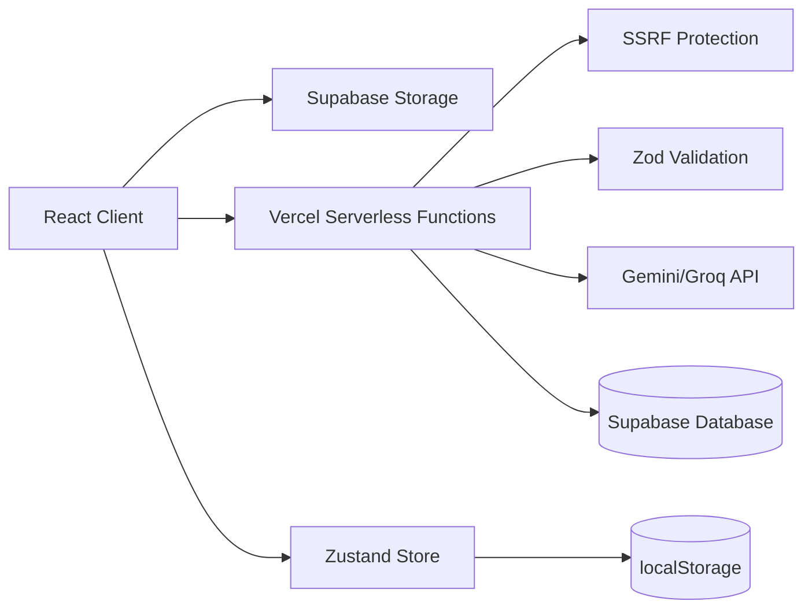

# SmartWay

A web application that converts uploaded documents or text into study materials (summaries, flashcards, and quizzes) using AI APIs.

## Project Overview

SmartWay processes user-provided content—either direct text input or uploaded documents (PDF, Word, text files)—and generates structured study materials. The application uses Google Gemini AI or Groq APIs to create summaries, flashcards, and multiple-choice quizzes. Documents are uploaded to Supabase storage, and the API processes them server-side with SSRF protection and file size limits.

The application is built as a React single-page application with Vercel serverless functions for the backend. State management uses Zustand with localStorage persistence, and the UI is built with Bootstrap 5 and Framer Motion animations. The system includes fallback offline generation when AI APIs are unavailable and implements request throttling to manage API rate limits.

## Key Features

### Document Processing
- **Multi-format support**: PDF (.pdf), Word (.docx, .doc), and text (.txt) files
- **Server-side text extraction**: Uses `pdf-parse` for PDFs and `mammoth` for Word documents
- **File size limits**: 10MB maximum download size enforced server-side
- **SSRF protection**: File URLs restricted to Supabase storage domains only

### API Architecture
- **Serverless functions**: Vercel Node.js 20.x runtime for API endpoints
- **Request validation**: Zod schemas for input validation on `/api/generate` and `/api/pack`
- **AI provider fallback**: Primary Gemini API with Groq fallback on 503/429 errors
- **JSON repair**: Handles truncated AI responses by closing dangling JSON structures
- **Rate limit handling**: Implements retry logic with exponential backoff

### State Management
- **Zustand store**: Client-side state for study packs and history
- **localStorage persistence**: Persists packs and history with quota error handling
- **History tracking**: Maintains up to 30 study pack records with metadata
- **Deterministic caching**: Content-based cache keys to avoid duplicate generations

### Security Controls
- **SSRF allowlist**: File URL validation restricted to `.supabase.co` domains
- **File size validation**: Server-side 10MB limit enforcement
- **Input validation**: Zod schema validation for all API requests
- **CORS configuration**: Configurable origin headers via environment variables

### Error Handling
- **Fallback generation**: Offline study pack creation when AI APIs fail
- **Request throttling**: 45-second minimum between requests
- **Retry with countdown**: Automatic retry on rate limit errors with countdown timer
- **LocalStorage quota handling**: Graceful degradation when storage quota exceeded

## Architecture



### Components

- **Frontend**: React 19 + TypeScript + Vite
- **Backend**: Vercel serverless functions (Node.js 20.x)
- **Storage**: Supabase (file storage and database)
- **State**: Zustand with localStorage persistence
- **UI**: Bootstrap 5 + Framer Motion
- **Document Processing**: `pdf-parse`, `mammoth`

### API Endpoints

- `POST /api/generate` - Main generation endpoint with count parameters
- `GET /api/health` - Health check endpoint
- `POST /api/pack` - Study pack persistence for shareable links
- `GET /api/pack/:slug` - Retrieve stored study pack by slug

## Development

### Prerequisites
- Node.js 20+
- Supabase project with storage bucket
- Google Gemini API key or Groq API key

### Setup

1. Install dependencies:
```bash
npm install
```

2. Configure environment variables (`.env`):
```env
GEMINI_API_KEY=your_gemini_key
GROQ_API_KEY=your_groq_key
VITE_SUPABASE_URL=your_supabase_url
VITE_SUPABASE_ANON_KEY=your_supabase_anon_key
SUPABASE_SERVICE_ROLE_KEY=your_service_role_key
ALLOWED_ORIGIN=http://localhost:5173
```

3. Run development servers:
```bash
npm run dev:full  # Both frontend and backend
# or separately:
npm run dev        # Frontend only
npm run dev:server # Backend only
```

### Build and Deploy

```bash
npm run build
npm run deploy    # Deploy to Vercel
```

## Project Structure

```
smartway/
├── api/                    # Vercel serverless functions
│   ├── _lib/              # Shared API utilities
│   │   ├── ssrf.ts        # SSRF protection
│   │   └── validators.ts  # Zod schemas
│   ├── generate.js        # Main generation endpoint
│   ├── health.js          # Health check
│   └── pack.js            # Pack persistence
├── src/
│   ├── api/               # TypeScript API client
│   ├── components/        # React components
│   ├── hooks/             # Custom React hooks
│   ├── lib/               # External library configurations
│   ├── pages/             # Page components
│   ├── store/             # Zustand stores
│   ├── styles/            # SCSS styles
│   └── utils/             # Utility functions
├── local-api.cjs          # Local development server
├── vite.config.ts         # Vite configuration
└── vercel.json            # Vercel deployment config
```

## Technical Implementation

### Cache Key Generation
The application uses a deterministic cache key based on content hash and generation settings:
```typescript
function buildCacheKey(source: string): string {
  // FNV-1a hash on first 8000 characters + length suffix
  // Handles UTF-8 characters safely without btoa()
}
```

### JSON Repair for Truncated Responses
The API includes a repair function for AI responses that exceed token limits:
```javascript
function repairTruncatedJson(source) {
  // Closes dangling arrays/objects and removes trailing commas
  // Allows partial recovery of valid JSON structure
}
```

### LocalStorage Quota Handling
The Zustand store implements error handling for localStorage quota limits:
```typescript
setItem: (name, value) => {
  try {
    localStorage.setItem(name, value);
  } catch {
    // Fallback: trim history to 5 items and retry
    // Silently fails if still unable to write
  }
}
```

## License

MIT